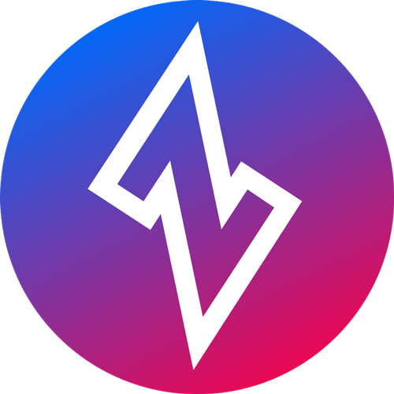

<p align="center" width="100%">
<a href="https://openziti.io"></a>
</p>

<p align="center">
    <b>
    <a>@openziti/ziti-sdk-nodejs</a>
    <br>
    <br>
    <b>
    A NodeJS-based SDK for delivering secure applications over a [Ziti Network](https://openziti.io)
    <br>
    <br>
    <b>Part of the <a href="https://openziti.io/about">OpenZiti</a> ecosystem</b>
</p>

<p align="center">
    <br>
    <b>Are you interested in knowing how to easily embed programmable, high performance, zero trust networking into your NodeJS app, on any internet connection, without VPNs?
    <br>
    Learn more about our <a href="https://openziti.io/about">OpenZiti</a> project.</b>
    <br>
    </p>

---
[]()
[]()
[](https://badge.fury.io/js/@openziti%2Fziti-sdk-nodejs.svg)
[](https://opensource.org/licenses/Apache-2.0)
[]()
[](CONTRIBUTING.md)
[](CODE_OF_CONDUCT.md)

---


# Supported platforms

The `ziti-sdk-nodejs` module works with Node.js v11.x, v12.x, v13.x, v14.x

Binaries for most Node versions and platforms are provided by default via [node-pre-gyp](https://github.com/mapbox/node-pre-gyp).

# Installing

``` js
npm i @openziti/ziti-sdk-nodejs
```


# Usage

**Note:** the module must be [installed](#installing) before use.

``` js
var ziti = require('ziti-sdk-nodejs');

const ziti_init = async (identity) => {
    return new Promise((resolve) => {
        ziti.ziti_init(identity, () => {
            resolve();
        });
    });
};

const ziti_service_available = (service) => {
    return new Promise((resolve) => {
        ziti.ziti_service_available(service, (status) => {
            resolve(status);
        });
    });
};

function ziti_dial(service) {
    return new Promise((resolve, reject) => {
        ziti.ziti_dial(
            service,
            (conn) => {
                resolve(conn);
            },
            (data) => {
                // Do something with data...
            },
        );
    });
}

const ziti_write = (conn, data) => {
    return new Promise((resolve) => {
        ziti.ziti_write(conn, data, () => {
            resolve();
        });
    });
};

(async () => {

    await ziti_init(LOCATION_OF_IDENTITY_FILE);

    let status = await ziti_service_available(YOUR_SERVICE_NAME);

    if (status === 0) {

        const conn = await ziti_dial(YOUR_SERVICE_NAME);

        let data = SOME_KIND_OF_DATA;

        let buffer = Buffer.from(data);

        await ziti_write(conn, buffer);

        ...etc
    }

})();
```


# Ziti NodeJS SDK - Setup for Development

The following steps should get your NodeJS SDK for Ziti building. The Ziti NodeJS SDK is a native addon for Node JS,
and is written in C. C development is specific to your operating system and tool chain used. These steps should work 
properly for you but if your OS has variations you may need to adapt these steps accordingly.


## Prerequisites

### Build

* [Cmake (3.12+)](https://cmake.org/install/)


## Build

### Linux/MacOS

Building the NodeJS SDK on linux/mac can be accomplished with:

```bash
$ npm run build
```


Getting Help
------------
Please use these community resources for getting help. We use GitHub [issues](https://github.com/NetFoundry/ziti-sdk-nodejs/issues) 
for tracking bugs and feature requests and have limited bandwidth to address them.

- Read the [docs](https://netfoundry.github.io/ziti-doc/ziti/overview.html)
- Join our [Developer Community](https://developer.netfoundry.io)
- Participate in discussion on [Discourse](https://openziti.discourse.group/)


Copyright&copy;  NetFoundry, Inc.
